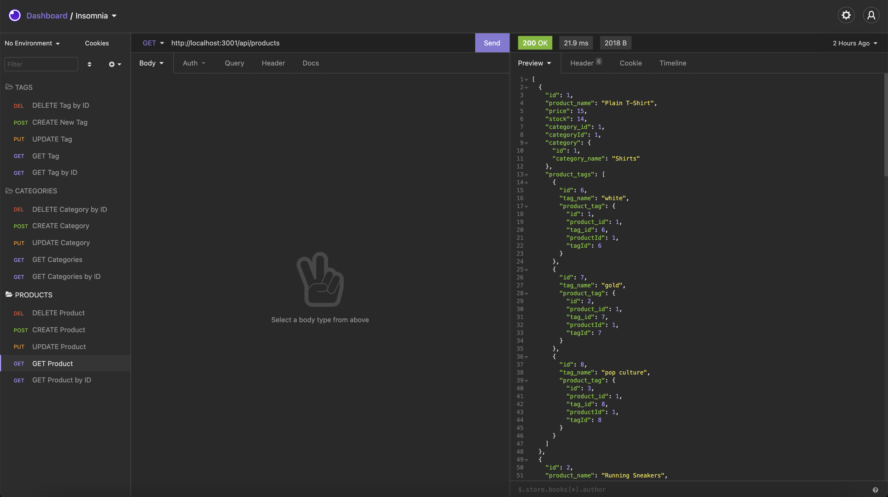
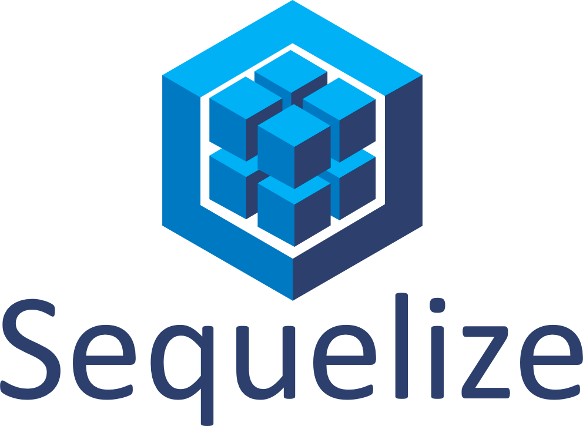

# E-Commerce-Back-End

## Table of Contents
* <a href="#about">About</a>
* <a href="#preview">Preview</a>
* <a href="#user-story">User Story</a>
* <a href="#acceptance-criteria">Acceptance Criteria</a>
* <a href="#installation">Installation</a>
* <a href="#questions">Questions</a>
* <a href="#technologies">Technologies</a>

## About 

Internet retail, also known as <b>e-commerce</b>, is the largest sector of the electronics industry, generating an estimated $29 trillion in 2019. E-commerce platforms like Shopify and WooCommerce provide a suite of services to businesses of all sizes. Due to their prevalence, understanding the fundamental architecture of these platforms will benefit you as a full-stack web developer.

This repo includes the  <b>back end for an e-commerce site</b>. I configured a working Express.js API to use Sequelize to interact with a MySQL database.

## Preview


## User Story
```
AS A manager at an internet retail company
I WANT a back end for my e-commerce website that uses the latest technologies
SO THAT my company can compete with other e-commerce companies
```

## Acceptance Criteria
```
GIVEN a functional Express.js API
WHEN I add my database name, MySQL username, and MySQL password to an environment variable file
THEN I am able to connect to a database using Sequelize
WHEN I enter schema and seed commands
THEN a development database is created and is seeded with test data
WHEN I enter the command to invoke the application
THEN my server is started and the Sequelize models are synced to the MySQL database
WHEN I open API GET routes in Insomnia Core for categories, products, or tags
THEN the data for each of these routes is displayed in a formatted JSON
WHEN I test API POST, PUT, and DELETE routes in Insomnia Core
THEN I am able to successfully create, update, and delete data in my database
```

## Installation
* On this page, click on the "clone or download" button. At the bottom of the drop down click the "Download Zip" button.

* Open up the "E-Commerce-Back-End" file in a command terminal.

* Use "npm install" to install all required dependencies for the app.
```
npm install
```

* Use "npm run seed" to seed data to your database so that you can test your route.
```
npm run seed
```

* Use "node index.js" in the command line within your terminal to run the application.
```
node server.js
```
## Questions
<a href="https://github.com/CodingNav/"><b>CodingNav</b></a>
<br>
You can reach me with additional questions at: 
<br>
navleenkaurr@gmail.com

# Technologies
&nbsp; &nbsp; &nbsp; 
&nbsp; &nbsp; &nbsp; 
&nbsp; &nbsp; &nbsp; 

&nbsp; &nbsp; &nbsp; 

&nbsp; &nbsp; &nbsp; 
